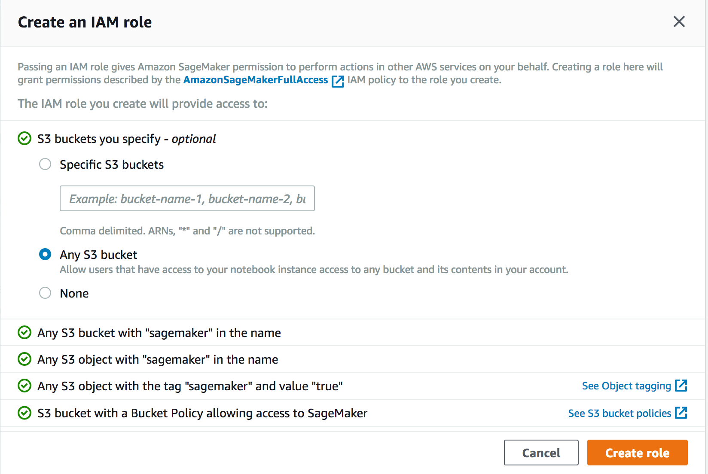

# Sagemaker Workshop - From Inception to Inference

Enterprises today are exploring ways to upgrade existing applications to harvest value from **machine learning**. Business have lots of structured and unstructured data already. Machine learning is not a one time activity where you train a model and  it can live forever. There are things such as concept drift that makes the model stale. The stale model has to be minimally periodically retrained with fresh batch of data. To continue to get value out of machine learning models we need an architecture and process in place to repeatedly and consistently train new models and retrain existing models with new data.

In the workshop, we will discuss how you can build an end to end pipeline for machine learning. Machine learning is more than building a cool model. It involves tasks that includes data sourcing, data ingestion, data transformation, pre-processing data for use in training, training a model and hosting the model.

AWS provides several services to address specific needs of different stages of machine learning pipeline. The workshop have multiple labs that focus on different stages of machine learning pipeline. We will be demonstrating the overall flow and design of machine learning pipeline

This is a self-paced workshop which will guide you through the complete Machine learning process for a Car evaluation use case .

In this workshop we’ll use the Car Evaluation Data Set from UCI’s Machine Learning Repository. Our goal is to predict the acceptability of a specific car, amongst the values of: unacc, acc, good, and vgood. At the core, it is a classification problem and we will train a machine learning model using Amazon SageMaker’s built-in XGBoost algorithm. However, the dataset only contains six categorical string features - buying, maint, doors, persons, lug_boot, and safety and XGBoost can only process data that is in numerical format. Therefore we will pre-process the input data using SparkML StringIndexer followed by OneHotEncoder to convert it to numerical format. We will also apply a post-processing step on the prediction result using SparkML IndexToString to convert our inference output back to their original labels that correspond to the predicted condition of the car.

We’ll write our SparkML pre-processing and post-processing scripts once, and apply them for processing training data using AWS Glue. Then, we will serialize and capture the SparkML artifacts produced by AWS Glue to Amazon S3 using MLeap. This is so that they can be reused during inference for real-time requests using the SparkML Serving container that Amazon SageMaker provides. Finally, we will deploy the pre-processing, inference, and post-processing steps in an inference pipeline and will execute these steps in order for each real-time inference request.

The workshop is using services including Amazon S3, AWS Glue , Amazon Sagemaker ,  AWS Amplify and AWS Cloud9

This workshop is split into three sections :

Section 1 : Data Engineering -
In Lab 1, we will source the  dataset from external source on internet, bring it to S3 . In enterprises the equivalent data may be already  present in some RDS, NoSQL or Data-warehouse system. The data can be ingested as a one time full-load as a batch or as a real-time stream of data. Depending on the usecase, there may be a need to do both batch and stream or just a batch or a stream. In the current workshop, we will do a one full-load of data into S3.In this Lab, you will use Glue Data Catalog to define schema on the data stored in S3 . You will perform ETL on the data to prepare it for the machine learning process.

Section 2 : Machine Learning - At this point you should have all you files in an AWS S3 bucket ready for Data Science work. We will use Amazon Sagemaker for model training and inference.

Section 3 : Inference on a Single Page Application- Once the machine learning process is complete ,you should be able to run the inference on a Single Page Application using AWS Amplify .

The labs are **sequential** and participants will have to complete them in the sequence. Each lab has references to resources and instruction to help you complete the lab successfully.

# Reference Architecture

There are some prerequisites to kick-off the workshop as mentioned below :

# Pre-requisites

## Step 1:
Create an AWS Account 
The code and instructions in this workshop assume only one participant is using a given AWS account at a time. If you attempt sharing an account with another participant, you will encounter naming conflicts for certain resources. You can work around this by either using a suffix in your resource names or using distinct Regions, but the instructions do not provide details on the changes required to make this work.
Use a personal account or create a new AWS account for this workshop rather than using an organization’s account to ensure you have full access to the necessary services and to ensure you do not leave behind any resources from the workshop.
Find here information on how to set up your AWS Account >>

## Step 2: Region
Use US East (N. Virginia), US West (Oregon), or EU (Ireland) for this workshop. Each supports the complete set of services covered in the material. Consult the Region Table to determine which services are available in a Region.

## Step 3 :Creating a Notebook Instance

### Jupyter Notebooks:  A Brief Overview

Jupyter is an open-source web application that allows you to create and share documents that contain live code, equations, visualizations and narrative text. Uses include: data cleaning and transformation, numerical simulation, statistical modeling, data visualization, machine learning, and much more. With respect to code, it can be thought of as a web-based IDE that executes code on the server it is running on instead of locally. 

There are two main types of "cells" in a notebook:  code cells, and "markdown" cells with explanatory text. You will be running the code cells.  These are distinguished by having "In" next to them in the left margin next to the cell, and a greyish background.  Markdown cells lack "In" and have a white background. In the screenshot below, the upper cell is a markdown cell, while the lower cell is a code cell:

To run a code cell, simply click in it, then either click the **Run Cell** button in the notebook's toolbar, or use Control+Enter from your computer's keyboard. It may take a few seconds to a few minutes for a code cell to run. You can determine whether a cell is running by examining the `In[]:` indicator in the left margin next to each cell:  a cell will show `In [*]:` when running, and `In [a number]:` when complete.

Please run each code cell in order, and **only once**, to avoid repeated operations.  For example, running the same training job cell twice might create two training jobs, possibly exceeding your service limits.

We'll start by creating a SageMaker notebook instance, which we will use for the other workshop modules.

### 1. Launching the Notebook Instance

1. Make sure you are on the AWS Management Console home page.  In the **Find Services** search box, type **SageMaker**.  The search result list will populate with Amazon SageMaker, which you should now click.  This will bring you to the Amazon SageMaker console homepage.

2. In the upper-right corner of the AWS Management Console, confirm you are in the desired AWS region. Select N. Virginia, Oregon, Ohio, or Ireland.

3. To create a new notebook instance, click the **Notebook instances** link on the left side, and click the **Create notebook instance** button in the upper right corner of the browser window.

4. Type smworkshop-[First Name]-[Last Name] into the **Notebook instance name** text box, and select ml.m5.xlarge for the **Notebook instance type**.

5. In the **Permissions and encryption** section, choose **Create a new role** in the **IAM role** drop down menu.  In the resulting pop-up modal, select **Any S3 bucket**.  Click **Create role**.

6. You will be taken back to the Create Notebook instance page.  Now you should see a message saying "Success! You created an IAM role."

7. Click **Create notebook instance** at the bottom.

### 2. Accessing the Notebook Instance

1. Wait for the server status to change to **InService**. This will take several minutes, possibly up to ten but likely much less.

2. Click **Open Jupyter**. You will now see the Jupyter homepage for your notebook instance. The notebook instance will be empty and will look like below 

### 3. Download the notebooks

The operating system of Jupyter Notebook server of SageMaker is a customized Linux server specially
tuned for machine learning environment. You can directly access this Linux server using a web-based Terminal interface that Jupyter Notebook server provides. To run it, Go to Open Jupyter-> Click on “New” -> Terminal 

In Terminal, run below Linux shell commands to download a sample Jupyter notebook 

`cd SageMaker/`

`git clone https://github.com/Aashmeet/ml-end-to-end-workshop`

After cloning the git, click the top-left Jupyter icon to go back to the notebook. Clicking Refresh icon on
the top-right corner to see a newly created folder (ai-ml-workshop). Click the folder and verify that the notebook exists.

Open the notebook in the folder "Car Evaluation" and now you are ready to start working on the three parts of the workshop.

## Part 1 - Data Engineering 

In this section, we’ll use Apache Spark MLLib for data processing using AWS Glue and reuse the data processing code during inference. We’ll use the Car Evaluation Data Set from  UCI’s Machine Learning Repository.

Our goal is to predict the acceptability of a specific car, amongst the values of unacc, acc, good, and vgood. 

At the core, it is a classification problem, and we will train a machine learning model using Amazon SageMaker’s built-in  XGBoost algorithm.
However, the dataset only contains six categorical string features – buying, maint, doors, persons, lug_boot, and safety and XGBoost can only process data that is in numerical format.
Therefore we will pre-process the input data using SparkML StringIndexer followed by OneHotEncoder to convert it to a numerical format. We will also apply a post-processing step on the prediction result using IndexToString to 
convert our inference output back to their original labels that correspond to the predicted condition of the car.

We’ll write our pre-processing and post-processing scripts once, and apply them for processing training data using AWS Glue. 
Then, we will serialize and capture these artifacts produced by AWS Glue to Amazon S3 using MLeap, a common serialization format and execution engine for machine learning pipelines.
This is so the pre-processing steps can be reused during inference for real-time requests using the SparkML Serving container that Amazon SageMaker provides. 
Finally, we will deploy the pre-processing, inference, and post-processing steps in an inference pipeline and will execute these steps for each real-time inference request.

### 1.1 Set up Data 
1. Open the Notebook and Select Kernel->Restart and clear all Outputs 

2. Go to the part 1 of the Lab and execute the initial steps 

Execute the steps in the notebook to set up the S3 bucket and download the required dataset as per the instructions .

3. These are steps/cells 1.1 to 1.3 in the 'Car Evaluation' Jupyter notebook .

4. Once complete , look at the created S3 bucket and the contents . These would map to the screenshots below :

Folder 'data' and 'scripts' will be created . 

Folder 'data' will have the sample car evaluation data .

Folder 'scripts' will have the scripts required to execute the ETL Transformation 

Once complete , you will create a Glue job to execute the steps . 

### 1.2  Glue Job Process 
If you take a look at the data we downloaded, you’ll notice all of the fields are categorical data in string format, which XGBoost cannot natively handle. In order to utilize SageMaker’s XGBoost, we need to preprocess our data into a series of one hot encoded columns. Apache Spark provides preprocessing pipeline capabilities that we will utilize.

Furthermore, to make our endpoint particularly useful, we also generate a post-processor in this script, which can convert our label indexes back to their original labels. All of these processor artifacts will be saved to S3 for SageMaker’s use later.
For the Glue Job to be created ,please follow the below steps :

1.	Check the permission of the Role created above in Sagemaker . Go to IAM->Role ->Enter the role and check the trusted entities as per below .

2. Go to Services -> AWS Glue 

3.	At the left ,under the "ETL" tab , click Jobs 

4.	Click on " Add Job"

5.	Provide the Job details as per below 
   `Name - preprocessing-cars-alias`
   
   `IAM role -Use the IAM role created with Sagemaker `
   
   `Type - Spark`
   
   `This job runs :  "An existing script that you can provide "`
   
   `ETL Language - Python`
   
   `Script File Name - s3:// 'Provide the s3 bucket name'/scripts/preprocessor.py`
   
   `S3 path where the script is stored`
   
   
   
 6.	Keep the Advanced Properties and Tags as default
 
 7. Click on "Security Configuration ,script libraries and job parameters
 
    `Python Library path - s3://'Provide the s3 bucket name'/scripts/python.zip`
    
    `Dependent jars path -s3://'Provide the s3 bucket name'/scripts/mleap_spark_assembly.jar`
   
     
     
 8. Add the following Job parameters 
 
 		--s3_input_data_location -  s3://'Provide the s3 bucket name'/data/car.data
      
 		--s3_model_bucket_prefix -   model

 		--s3_model_bucket -   'Provide the s3 bucket name'
      
 		--s3_output_bucket - 'Provide the s3 bucket name'
      
 		--s3_output_bucket_prefix  -  output
      
 	  
   
 9.	Click on Save Job and Edit Script 
 
     
     
 10. Click on "Run Job" . The job will take about 7-8 minutes to finish. 
 
 
 11.  Check the logs for the Glue execution and make sure there are no errors.
      
     
      
      
 12.  When the job is complete ,you should be able to see the "Success" status of the Glue Job.
 
       
    
       

 
 Here is the explanation of what the job is actually doing :
 While executing the notebook, you downloaded our preprocessor.py script, and we recommend you take the time to explore how Spark pipelines are handled. Let’s take a look at the relevant part of the code where we define and fit our Spark pipeline:

    # Target label
    catIndexer = StringIndexer(inputCol="cat", outputCol="label")

    labelIndexModel = catIndexer.fit(train)
    train = labelIndexModel.transform(train)

    converter = IndexToString(inputCol="label", outputCol="cat")

    # Index labels, adding metadata to the label column.
    # Fit on whole dataset to include all labels in index.
    buyingIndexer = StringIndexer(inputCol="buying", outputCol="indexedBuying")
    maintIndexer = StringIndexer(inputCol="maint", outputCol="indexedMaint")
    doorsIndexer = StringIndexer(inputCol="doors", outputCol="indexedDoors")
    personsIndexer = StringIndexer(inputCol="persons", outputCol="indexedPersons")
    lug_bootIndexer = StringIndexer(inputCol="lug_boot", outputCol="indexedLug_boot")
    safetyIndexer = StringIndexer(inputCol="safety", outputCol="indexedSafety")

    # One Hot Encoder on indexed features
    buyingEncoder = OneHotEncoder(inputCol="indexedBuying", outputCol="buyingVec")
    maintEncoder = OneHotEncoder(inputCol="indexedMaint", outputCol="maintVec")
    doorsEncoder = OneHotEncoder(inputCol="indexedDoors", outputCol="doorsVec")
    personsEncoder = OneHotEncoder(inputCol="indexedPersons", outputCol="personsVec")
    lug_bootEncoder = OneHotEncoder(inputCol="indexedLug_boot", outputCol="lug_bootVec")
    safetyEncoder = OneHotEncoder(inputCol="indexedSafety", outputCol="safetyVec")

    # Create the vector structured data (label,features(vector))
    assembler = VectorAssembler(inputCols=["buyingVec", "maintVec", "doorsVec", "personsVec", "lug_bootVec", "safetyVec"], outputCol="features")

    # Chain featurizers in a Pipeline
    pipeline = Pipeline(stages=[buyingIndexer, maintIndexer, doorsIndexer, personsIndexer, lug_bootIndexer, safetyIndexer, buyingEncoder, maintEncoder, doorsEncoder, personsEncoder, lug_bootEncoder, safetyEncoder, assembler])

    # Train model.  This also runs the indexers.
    model = pipeline.fit(train)

This snippet defines both our preprocessor and postprocessor. The preprocessor converts all the training columns from categorical labels into a vector of one-hot encoded columns, while the post-processor converts our label index back to a human readable string.

In addition, it may be helpful to examine the code which allows us to serialize and store our Spark pipeline artifacts in the MLeap format. Because the Spark framework was designed around batch use cases, we need to use MLeap here. MLeap serializes SparkML Pipelines and provides run time for deploying for real-time, low latency use cases. Amazon SageMaker has launched a SparkML Serving container that uses MLEAP to make it easy to use. Let’s look at the code below:

    # Serialize and store via MLeap  
    SimpleSparkSerializer().serializeToBundle(model, "jar:file:/tmp/model.zip", predictions)

    # Unzipping as SageMaker expects a .tar.gz file but MLeap produces a .zip file.
    import zipfile
    with zipfile.ZipFile("/tmp/model.zip") as zf:
        zf.extractall("/tmp/model")

    # Writing back the content as a .tar.gz file
    import tarfile
    with tarfile.open("/tmp/model.tar.gz", "w:gz") as tar:
        tar.add("/tmp/model/bundle.json", arcname='bundle.json')
        tar.add("/tmp/model/root", arcname='root')

    s3 = boto3.resource('s3')
    file_name = args['s3_model_bucket_prefix'] + '/' + 'model.tar.gz'
    s3.Bucket(args['s3_model_bucket']).upload_file('/tmp/model.tar.gz', file_name)

    os.remove('/tmp/model.zip')
    os.remove('/tmp/model.tar.gz')
    shutil.rmtree('/tmp/model')

    # Save postprocessor
    SimpleSparkSerializer().serializeToBundle(converter, "jar:file:/tmp/postprocess.zip", predictions)

    with zipfile.ZipFile("/tmp/postprocess.zip") as zf:
        zf.extractall("/tmp/postprocess")

    # Writing back the content as a .tar.gz file
    import tarfile
    with tarfile.open("/tmp/postprocess.tar.gz", "w:gz") as tar:
        tar.add("/tmp/postprocess/bundle.json", arcname='bundle.json')
        tar.add("/tmp/postprocess/root", arcname='root')

    file_name = args['s3_model_bucket_prefix'] + '/' + 'postprocess.tar.gz'
    s3.Bucket(args['s3_model_bucket']).upload_file('/tmp/postprocess.tar.gz', file_name)

    os.remove('/tmp/postprocess.zip')
    os.remove('/tmp/postprocess.tar.gz')
    shutil.rmtree('/tmp/postprocess')

You’ll notice we unzip this archive and re-archive it into a tar.gz file that SageMaker recognizes.

With the completion of these steps , the S3 bucket you created will have the structure as per the diagram below . 

  

## Part 2 - Machine Learning 

In this section ,we will define the machine learning process to create a model using XGBoost to do real time inference .

Now that we have our data preprocessed in a format that XGBoost recognizes, we can run a simple training job to train a classifier model on our data. We can run this entire process in our Jupyter notebook.This will train the model on the preprocessed data we created earlier. After a few minutes, usually less than 5, the job should complete successfully, and output our model artifacts to the S3 location we specified. Once this is done, we can deploy an inference pipeline that consists of pre-processing, inference and post-processing steps.

Follow the steps/cells in the Jupyter notebook to execute the Machine learning part (labelled as 2) -this will include setting up a training job to build a model and then create an endpoint to host the model .

When the training job completes ,the status will be updated to "Completed"
   

When the endpoint is created ,the status will be updated to "InService"
  
    
On testing the inference locally ,the output is as below :
    
    
    
At this point , the machine learning process for the workload is complete and you are ready to build a Single Page application to derive inference from the trained model .

## Part 3- Inference via Single Page Application

In the Jupyter notebook , you have tested the inference on the Machine learning model .
Now we will build a SPA using AWS Amplify and React and will set up the process to test the inference via the web channel .

To set up the environment for the same , follow the below steps :

### Set up a Cloud9 Workspace
AWS Cloud9 is a cloud-based integrated development environment (IDE) that lets you write, run, and debug your code with just a browser. It includes a code editor, debugger, and terminal. Cloud9 comes prepackaged with essential tools for popular programming languages, including JavaScript, Python, PHP, and more, so you don’t need to install files or configure your development machine to start new projects.
In the instructions that follow, we describe the steps required to set up your AWS Cloud9
environment and get ready to implement the workshop.
Note: You must have a default VPC in the region you will run the workshop in. If you do not
have a default VPC, please create one by following the instructions at
https://docs.aws.amazon.com/vpc/latest/userguide/default-vpc.html#create-default-vpc

#### Create a new environment

1. Go to the Cloud9 web console
    

2. Select Create environment .Name it SMworkshop, and go to the Next step
 
 
 
3. Select Create a new instance for environment (EC2) and pick t2.medium

 

4. Leave all of the environment settings as they are, and go to the Next step and Click Create environment.

5. Your new AWS Cloud9 environment will be created automatically, and will take a moment to complete. When it is finished, you will see the IDE in your browser

6. Once the Cloud9 Environment is configured , you will need to doenload the project from the github and upload it to the Cloud9 Environment . For that extract the folder '' from the Github repository and click upload on the File Menu

  6.1 Go to the GitHub project and download the zip by clicking “clone or Download “ the project .
  
   
  
  6.2 Unzip the project in your local directory. 
  
  6.3 For this part ,the folder you would be accessing is amplify-sagemaker-master 

   
 
7. Make sure all the files are uploaded and then kick off the process to set up AWS Amplify environment .

 Before we begin coding, there are a few things we need to install, update, and configure in the Cloud9 environment.
 
 

In the Cloud9 terminal, run the following commands to install and update some software we’ll be using for this workshop:

#### Update the AWS CLI

` pip install --user --upgrade awscli`

#### Install and use Node.js v8.10 (to match AWS Lambda)
`nvm install v8.11.0`
`nvm alias default v8.11.0`

#### Install the AWS Amplify CLI
`npm install -g @aws-amplify/cli`

### Additional set up:
Before we start building our UI, we’ll also include Semantic UI components for React to give us components that will help make our interface look a bit nicer. 
Go to thr actual project folder and run the below command .

`npm install --save semantic-ui-react`

Now the environment is ready with all the required installs 

### Set up UI Environment

The next steps will help you set up a project im an environment.The project contains the single page app, API GW/Lambda function. The flow is Amplify SPA -> API GW -> Lambda -> Sagemaker endpoint.

#### Set up Amplify envioronment
Set up your AWS resources the Amplify CLI:

` $ amplify init `

This command creates new AWS backend resources (in this case a single S3 bucket to host your cloudformation templates) and pull the AWS service configurations into the app!
Follow the prompts as shown in the below Image. Remember, even if you are implementing the ios or android version of the application, you MUST choose javascript here since the admin panel is a web app that makes calls to the backend and is seperate from the client.

 
 
 
 
 

Now the required cloudformation templates are set up and it is time to create the cloud resources by pushing the changes:

`$ amplify push`

Execute amplify add hosting from the project's root folder and follow the prompts to create a S3 bucket (DEV) and/or a CloudFront distribution (PROD).

`$ amplify hosting Add`

While hosting ,choose the non-Prod option as per the below image 

  
Build and publish the application

` $ amplify publish`
    
  
  
    
Now you should get a url for the application . Access the SPA and invoke the sagemaker endpoint with the values .
  
