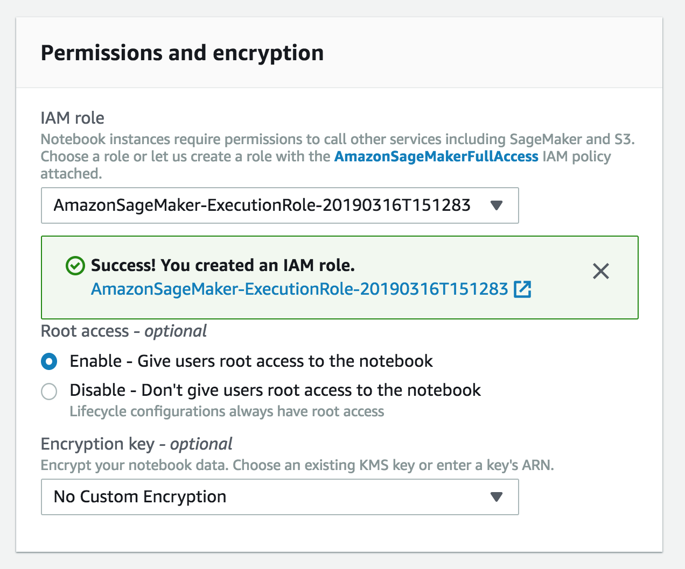
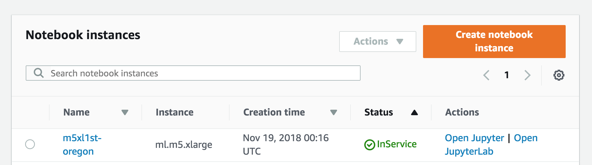

# Sagemaker Workshop - From Inception to Inference

Welcome to the workshop .This is a self-paced workshop which will guide you through the complete Machine learning process for a Car evaluation use case .

In this workshop we’ll use the Car Evaluation Data Set from UCI’s Machine Learning Repository. Our goal is to predict the acceptability of a specific car, amongst the values of: unacc, acc, good, and vgood. At the core, it is a classification problem and we will train a machine learning model using Amazon SageMaker’s built-in XGBoost algorithm. However, the dataset only contains six categorical string features - buying, maint, doors, persons, lug_boot, and safety and XGBoost can only process data that is in numerical format. Therefore we will pre-process the input data using SparkML StringIndexer followed by OneHotEncoder to convert it to numerical format. We will also apply a post-processing step on the prediction result using SparkML IndexToString to convert our inference output back to their original labels that correspond to the predicted condition of the car.

We’ll write our SparkML pre-processing and post-processing scripts once, and apply them for processing training data using AWS Glue. Then, we will serialize and capture the SparkML artifacts produced by AWS Glue to Amazon S3 using MLeap. This is so that they can be reused during inference for real-time requests using the SparkML Serving container that Amazon SageMaker provides. Finally, we will deploy the pre-processing, inference, and post-processing steps in an inference pipeline and will execute these steps in order for each real-time inference request.

The workshop is using services including Amazon S3, AWS Glue , Amazon Sagemaker ,  AWS Amplify and AWS Cloud9

This workshop is split into three sections :

Section 1 : Data Engineerimg 

Section 2 : Machine Learning

Section 3 : Inference on a Single Page Application

There are some prerequisites to kick-off the workshop as mentioned below :

# Pre-requisites
## Creating a Notebook Instance

We'll start by creating a SageMaker notebook instance, which we will use for the other workshop modules.

### 1. Launching the Notebook Instance

1. Make sure you are on the AWS Management Console home page.  In the **Find Services** search box, type **SageMaker**.  The search result list will populate with Amazon SageMaker, which you should now click.  This will bring you to the Amazon SageMaker console homepage.

2. In the upper-right corner of the AWS Management Console, confirm you are in the desired AWS region. Select N. Virginia, Oregon, Ohio, or Ireland.

3. To create a new notebook instance, click the **Notebook instances** link on the left side, and click the **Create notebook instance** button in the upper right corner of the browser window.

4. Type smworkshop-[First Name]-[Last Name] into the **Notebook instance name** text box, and select ml.m5.xlarge for the **Notebook instance type**.

5. In the **Permissions and encryption** section, choose **Create a new role** in the **IAM role** drop down menu.  In the resulting pop-up modal, select **Any S3 bucket**.  Click **Create role**.

6. You will be taken back to the Create Notebook instance page.  Now you should see a message saying "Success! You created an IAM role."

7. Click **Create notebook instance** at the bottom.

### 2. Accessing the Notebook Instance

1. Wait for the server status to change to **InService**. This will take several minutes, possibly up to ten but likely much less.

2. Click **Open Jupyter**. You will now see the Jupyter homepage for your notebook instance.

### 3. Download the notebooks

The operating system of Jupyter Notebook server of SageMaker is a customized Linux server specially
tuned for machine learning environment. You can directly access this Linux server using a web-based Terminal interface that Jupyter Notebook server provides. To run it, Go to Open Jupyter-> Click on “New” -> Terminal 

In Terminal, run below Linux shell commands to download a sample Jupyter notebook 

cd SageMaker/

git clone https://github.com/Aashmeet/ml-end-to-end-workshop

After cloning the git, click the top-left Jupyter icon to go back to the notebook. Clicking Refresh icon on
the top-right corner to see a newly created folder (ai-ml-workshop). Click the folder and verify that the notebook exists.

Open the notebook in the folder "Car Evaluation" and now you are ready to start working on the three parts of the workshop.

## Part 1 - Data Engineering 

In this section, we’ll use Apache Spark MLLib for data processing using AWS Glue and reuse the data processing code during inference. We’ll use the Car Evaluation Data Set from  UCI’s Machine Learning Repository.

Our goal is to predict the acceptability of a specific car, amongst the values of unacc, acc, good, and vgood. 

At the core, it is a classification problem, and we will train a machine learning model using Amazon SageMaker’s built-in  XGBoost algorithm.
However, the dataset only contains six categorical string features – buying, maint, doors, persons, lug_boot, and safety and XGBoost can only process data that is in numerical format.
Therefore we will pre-process the input data using SparkML StringIndexer followed by OneHotEncoder to convert it to a numerical format. We will also apply a post-processing step on the prediction result using IndexToString to 
convert our inference output back to their original labels that correspond to the predicted condition of the car.

We’ll write our pre-processing and post-processing scripts once, and apply them for processing training data using AWS Glue. 
Then, we will serialize and capture these artifacts produced by AWS Glue to Amazon S3 using MLeap, a common serialization format and execution engine for machine learning pipelines.
This is so the pre-processing steps can be reused during inference for real-time requests using the SparkML Serving container that Amazon SageMaker provides. 
Finally, we will deploy the pre-processing, inference, and post-processing steps in an inference pipeline and will execute these steps for each real-time inference request.

Execute the steps in the notebook to set up the S3 bucket and download the required dataset as per the instructions .

Once complete , you will create a Glue job to execute the steps .

## Part 2 - Machine Learning 

In this section ,we will define the machine learning process to create a model using XGBoost to do real time inference .

Now that we have our data preprocessed in a format that XGBoost recognizes, we can run a simple training job to train a classifier model on our data. We can run this entire process in our Jupyter notebook.This will train the model on the preprocessed data we created earlier. After a few minutes, usually less than 5, the job should complete successfully, and output our model artifacts to the S3 location we specified. Once this is done, we can deploy an inference pipeline that consists of pre-processing, inference and post-processing steps.

Follow the steps in the Jupyter notebook to execute the Machine learning part -this will include setting up a training job to build a model and then create an endpoint to host the model .

## Part 3- Inference via Single Page Application

In the Jupyter notebook , you have tested the inference on the Machine learning model .
Now we will build a SPA using AWS Amplify and React and will set up the process to test the inference via the web channel .

To set up the environment for the same , follow the below steps :

###Set up a Cloud9 Workspace
AWS Cloud9 is a cloud-based integrated development environment (IDE) that lets you write, run, and debug your code with just a browser. It includes a code editor, debugger, and terminal. Cloud9 comes prepackaged with essential tools for popular programming languages, including JavaScript, Python, PHP, and more, so you don’t need to install files or configure your development machine to start new projects.

Create a new environment

    Go to the Cloud9 web console
    Select Create environment
    Name it workshop, and go to the Next step
    Select Create a new instance for environment (EC2) and pick t2.medium
    Leave all of the environment settings as they are, and go to the Next step
    Click Create environment

Before we begin coding, there are a few things we need to install, update, and configure in the Cloud9 environment.

In the Cloud9 terminal, run the following commands to install and update some software we’ll be using for this workshop:

#### Update the AWS CLI
pip install --user --upgrade awscli

#### Install and use Node.js v8.10 (to match AWS Lambda)
nvm install v8.11.0
nvm alias default v8.11.0

#### Install the AWS Amplify CLI
npm install -g @aws-amplify/cli
git clone https://github.com/aws-samples/aws-mobile-appsync-chat-starter-angular.git
cd aws-mobile-appsync-chat-starter-angular

### Download the project from github
First, clone this repository and navigate to the created folder:

### Additional set up:
Before we start building our UI, we’ll also include Semantic UI components for React to give us components that will help make our interface look a bit nicer.

npm install --save semantic-ui-react

### Set up UI Environment

The next steps will help you set up a project im an environment.The project contains the single page app, API GW/Lambda function. The flow is Amplify SPA -> API GW -> Lambda -> Sagemaker endpoint.

#### Set up Amplify envioronment
Set up your AWS resources the Amplify CLI:
amplify init

Create the cloud resources by pushing the changes:
$ amplify push

Execute amplify add hosting from the project's root folder and follow the prompts to create a S3 bucket (DEV) and/or a CloudFront distribution (PROD).

Build and publish the application
    $ amplify publish
    
Now you should get a url for the application . Access the SPA and invoke the sagemaker endpoint with the values .
